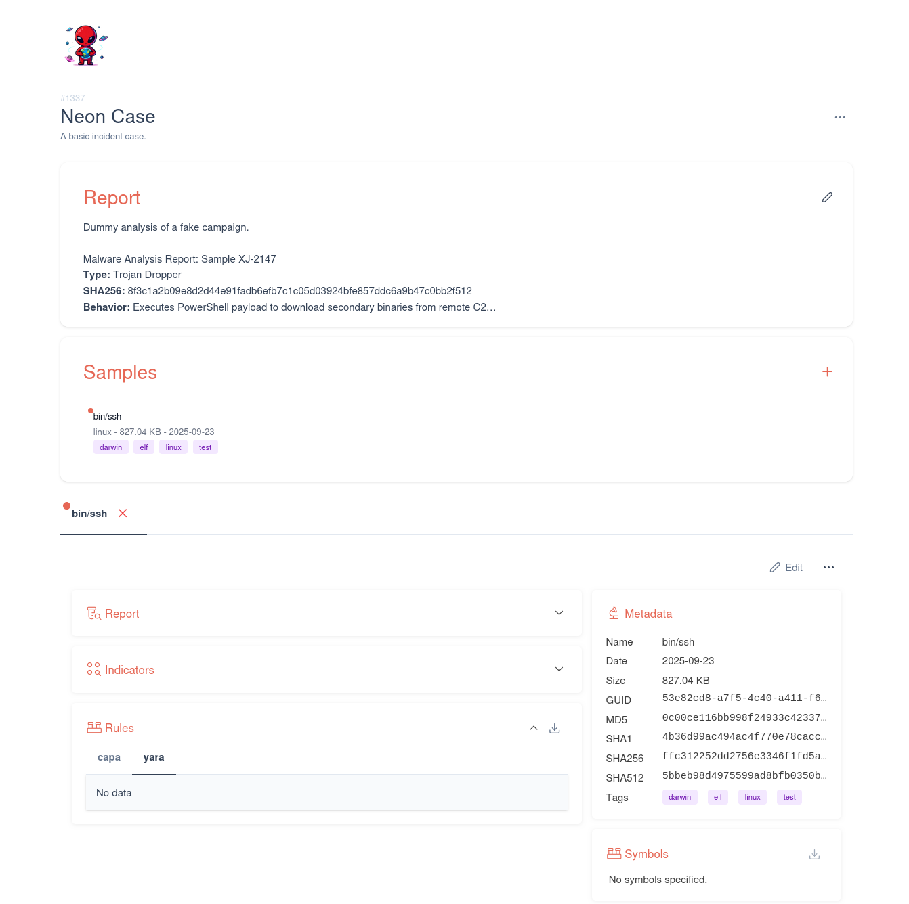

<p align="center"></p>
<h2 align="center">Neon</h2>

<div align="center">


[](/LICENSE)

</div>

<p align="center">Collaborative Malware Database Management</p>
<br>

<div align="center">



</div>

# Introduction

Neon is a minimalist malware database management system designed for efficient collaboration. After vitrifying payloads, analysts can dissect and document their findings through a dedicated interface, managing malicious artifacts.

Inspired by the idea of a Neon shedding light on malware.

<br>

## Getting Started

> [!NOTE]
> Neon is part of the [CERT-EDF/fusion](https://github.com/CERT-EDF/fusion) framework. This section will guide you for the standalone usage.

Deployment is designed to be simple using Docker.
```bash
export GIT_TAG="$(git describe --tags)"
docker compose up -d
```

Basic HTTP example using Nginx:
```nginx
server {
    listen 80;
    server_name neon.domain.lan;

    access_log  /var/log/nginx/neon.access.log;
    error_log  /var/log/nginx/neon.error.log;

    proxy_http_version 1.1;
    proxy_set_header X-Real-IP $remote_addr;
    proxy_set_header X-Forwarded-For $proxy_add_x_forwarded_for;
    proxy_set_header X-Forwarded-Proto $scheme;

    location /api {
      proxy_pass http://127.0.0.1:8113;
      client_max_body_size 4G;
      proxy_buffering off;
      proxy_set_header Upgrade $http_upgrade;
      proxy_set_header Connection "upgrade";
      proxy_set_header Host $host;
    }

    location / {
      proxy_pass http://127.0.0.1:8123;
    }
  }
```

<br>

## Configuration

Refer to the [configuration documentation](https://github.com/CERT-EDF/neon).

<br>

## License

Distributed under the MIT License.

<br>

## Contributing

Contributions are welcome, see [CONTRIBUTING.md](https://github.com/CERT-EDF/neon/blob/main/CONTRIBUTING.md) for more information.

<br>

## Security

To report a (suspected) security issue, see [SECURITY.md](https://github.com/CERT-EDF/neon/blob/main/SECURITY.md) for more information.
